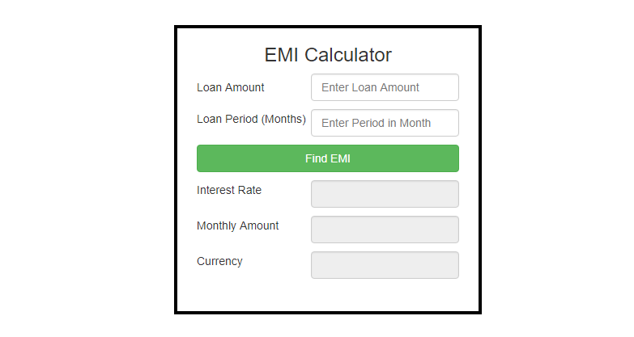

# Fullthrottle
Description
This Loan Calculator script calculates the interest rate and the payment to be done by the user for the entered loan amount and duration.

Features
Enter the variables into the form
Calculate monthly payment and total interest
Use of slider gives the user the experience of a calculation in progress.

Dependencies
Bootstrap

